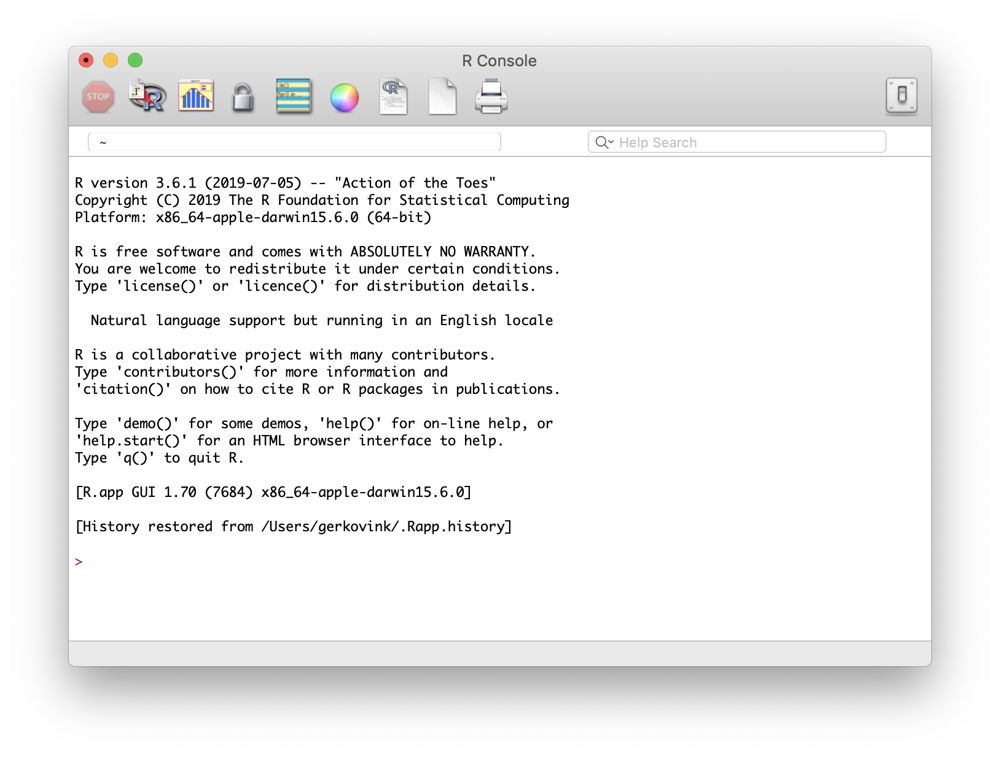
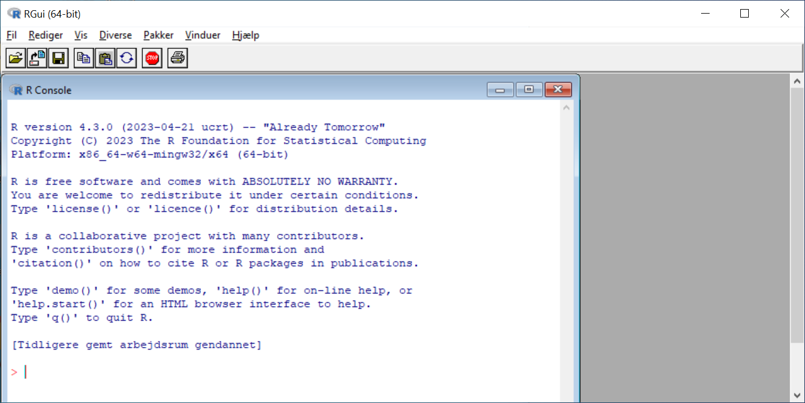
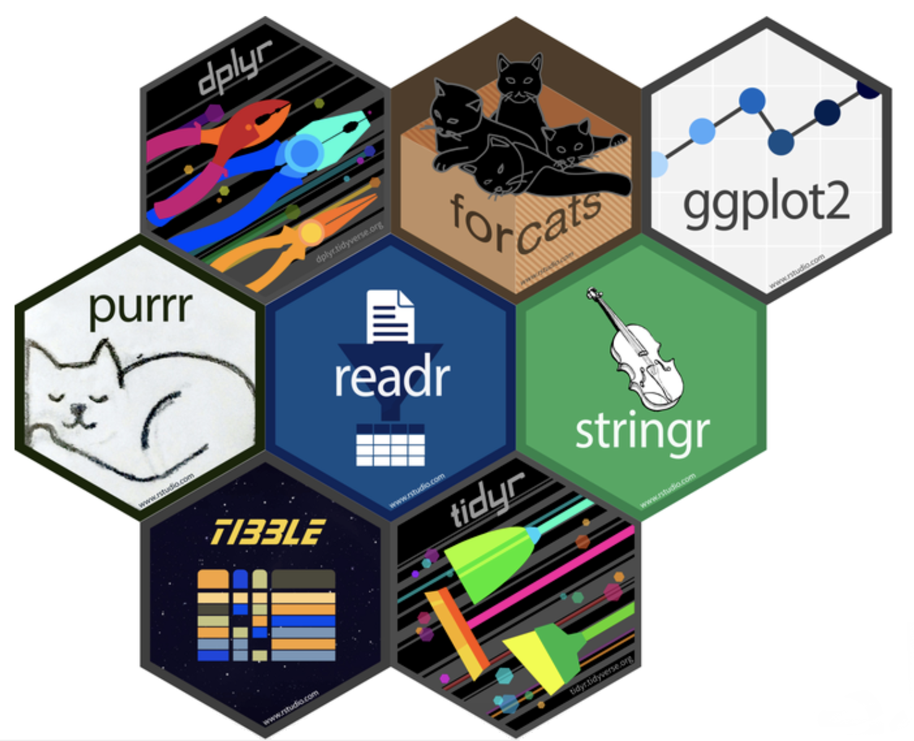
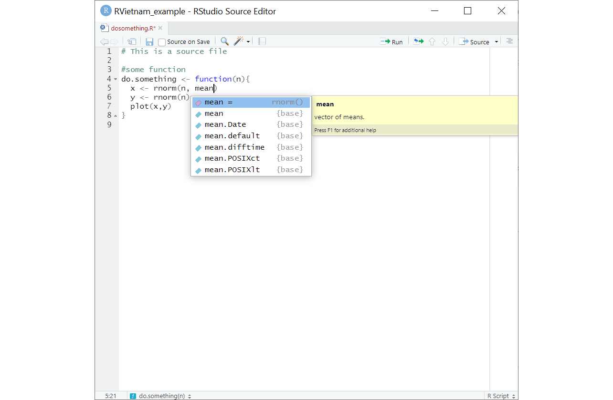

# Overview of this course
## Program


| Day         | Hours       | Topic                               |
|:------------|:------------|:------------------------------------|
| *Monday*    | 09.00-11.30 | Introduction to R and RStudio (A)   |
|             | 13.30-16.30 | How is R organized? (B)             |
| *Tuesday*   | 08.30-11.30 | Data manipulation (C)               |
|             | 13.30-16.30 | Analyzing data (D)                  |
| *Wednesday* | 08.30-11.30 | Data visualization  (E)             |
|             | 13.30-16.30 | Loops and functions (F)             |
| *Thursday*  | 08.30-11.30 | Linear regression and R Markdown (G)|
|             | 13.30-16.30 | Outstanding issues, Q and A         |

<!-- <center> -->
<!--  -->
<!-- </center> -->

## Format

- A mixture of presentations and exercises
- Program and course materials are located at `https://mmollerup.github.io/RVietnam/`
- Exercises with hints and solutions
   - Use hints 
- Ask

# What is R?

## Software
<center>
<!--  -->

</center>

<!-- ## The origin of R -->
<!-- - R is a language and environment for statistical computing and for graphics -->
<!-- - GNU project (100% free software) -->
<!-- - Managed by the R Foundation for Statistical Computing, Vienna, Austria. -->
<!-- - Community-driven -->
<!-- - Based on the object-oriented language S (1975) -->


## What is R?

- R is a programming language for statistical programming and graphics
- Opensource, powered by *the R Foundation for Statistical Computing*
- Driven by a volunteer community that develops packages for every imaginable purpose


## What is Tidyverse? 

- A collection of data management, modeling, and visualization packages that "share underlying design philosophy, grammar, and data structures"
- Characterized by the use of so-called "pipes", where the output of each line's code is passed on to the next link in the pipe. This generally makes for more readable code.
```{r echo=F, out.width='50%', out.extra='style="float:right; padding:10px"'}

```
- Load with `library(tidyverse)`


# What is RStudio?

## Integrated Development Environment
<center>
<!--  -->
 
</center>

## RStudio
- Integrated Development Environment (IDE)
- Aggregates all convenient information and procedures into one single place
- Allows you to work in projects
- Manages your code with highlighting
- Gives extra functionality (reports in html, doc, pfd, webpages...)
- Allows for integration with version control routines, such as Git.


# Workflow 

## Writing code
<center>
<!--  -->

</center>

This is why we use R-Studio.


## Projects

- A feature of RStudio.
- Basically: A project is a folder that contains a `.Rproj` file. When you open the project file, you start a new session, with your *working directory* in the project folder
   - *working directory*: Where `R` looks for files you want to load and puts files you want to save.
      - You can see your *working directory* with `getwd()`, and you can set it with `setwd()` - **but you should not do it**, because it results in more fragile code.
- It is good practice to keep all files belonging to a project in the same place.
- Projects make it easier to separate separate analyses, and make code more portable and robust.

## Projects in practice

- Create a separate folder and an RStudio project file for each project.
- Put your code files there.
- Save output there.
- Save output *with code* not as point-and-click.
- When you code paths to files, do so *relative to your project folder*.

```{r, eval=FALSE}
## Good!:
saveRDS( MyObject, "/Output/MyObject.RDS")

## No!:
saveRDS( MitObject, "C:/Documents/This Project/Output/MyObject.RDS")
```

*(Also note: R uses `/` and not `\` in paths to files)*


# Working in R

## The help
- Everything that is published on the Comprehensive `R` Archive Network (CRAN) and is aimed at `R` users, must be accompanied by a help file. 
- If you know the name of the function that performs an operation, e.g. `anova()`, then you just type `?anova` or `help(anova)` in the console. 
- If you do not know the name of the function: type `??` followed by your search criterion. For example `??anova` returns a list of all help pages that contain the word 'anova'

- Alternatively, the internet will tell you almost everything you'd like to know (and then some)

- Sites such as http://www.stackoverflow.com and http://www.stackexchange.com, as well as `Google` can be of tremendous help. 
    - If you google `R` related issues; use 'R:' as a prefix in your search term

## Objects and elements
- R works with objects that consist of elements. The smallest elements are numbers and characters.

    - These elements are assigned to objects. 
    - A set of objects can be used to perform calculations
    - Calculations can be presented as functions
    - Functions are used to perform calculations and return new objects, containing calculated (or estimated) elements. 
    - View the objects you have created in the Environment tab on the right of RStudio


## Assigning elements to objects
Assigning things in R is very straightforward: 

 - you just use `<-`

For example, if you assign the value `100` (an element) to object `a`, you would type

```{r}
a <- 100
```


Calling things in R is also very straightforward: 

 - you just use type the name you have given to the object

For example, we assigned the value `100` to object `a`. To call object `a`, we would type

```{r}
a
```


# Practical A

