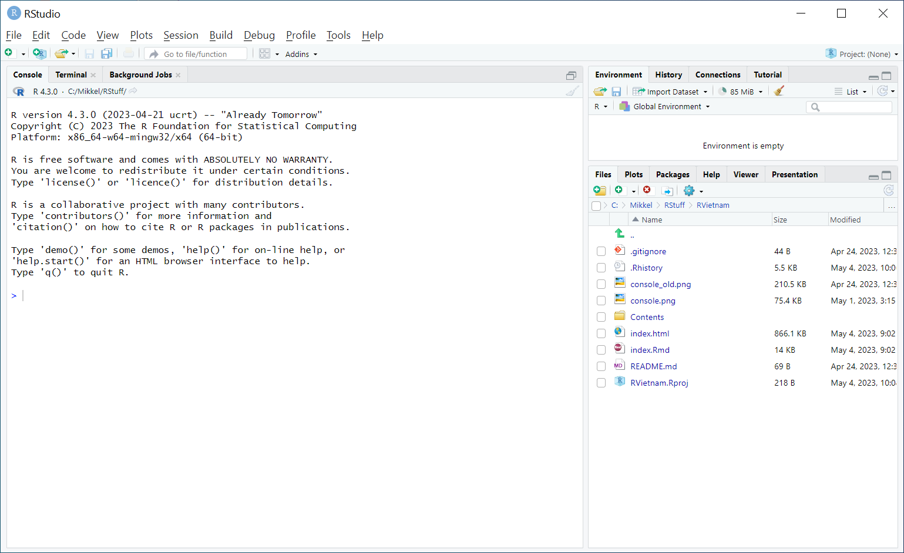
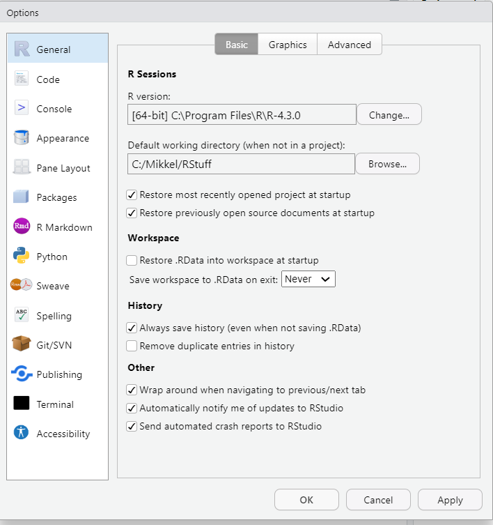

```{r setup, include=FALSE}
knitr::opts_chunk$set(echo = TRUE)
library(tidyverse)
library(webexercises)

```

---

Today we are going to get acquainted with R. A convenient way to work with R is through RStudio which adds many features and convenient options to the plain R interface. Most of these features go beyond the scope of this course, but as you will develop your R skillset, you might run into the need for them and hence RStudio so it is worthwhile to get to know RStudio right from the beginning. 
 
If you have no experience with R, you will learn the most from following this document step by step. If you have some experience with R already,  I suggest you try solving the questions without looking at the answers/walkthrough. You can always refer to the solutions as needed. 

If you have any questions or if you feel that some code should be elaborated, feel free to ask.

---

#### Exercises
We start with the very basics and will move towards more advanced operations in R. First we will get acquainted with the language and the environment we work in.  We run exercises with hints and solutions. Hints and solutions can be printed out individually.

---


## 1. Get started with RStudio 

Open RStudio.  

The following window will appear. You might be faced with a bit different layout, but don't dispair. Close to everything can be configured to your likings, including the colour scheme!   


RStudio is divided in 3 panes, namely the console, the environment/history pane and the pane where we can access our files, plots, the help files, make packages and view our data objects. You can change the order of the panes to your liking through RStudio's preferences. 

If we open an R-script (i.e. a file that contains R code), a fourth pane opens. 


### 1.1 Options in RStudio

Under the menu "Tools $\rightarrow$ Global Options..." are a few important settings.

Under the "General" tab, it is best not to restore .Rdata at startup and never to save your workspace at exit.


```{r echo=F, out.width='70%'}

```


## 2. Console
Switch to the console (bottom left) by clicking down there or with Ctrl+2.

In the console, you can write commands that are executed when you press Return.


### Exercise 2.1 

Try entering the following commands in the console: `2+2`, `sqrt(121)` and `round(0.6)`.

### Exercise 2.2

If we are not sure what the `round` function does, we can find a help file by typing `?round` or `help(round)`. Use this help to round 3.141593 to three decimal places.

`r hide("Solution")`

We look at the documentation for the `round` function. The **Description** section describes the function - in this case it is common documentation for the functions `ceiling`, `floor`, `trunc`, `round` and `signif`.

Under **Usage** we see what a call to the functions looks like, and under **Arguments** we get a more detailed description of the arguments to the function.

Note that `round` takes two arguments: `x` and `digits`. The argument `digits` has the default value zero, with which you can get away with not specifying it and just write `round(3.141593)` if you are satisfied with rounding to an integer. If you specify `digits', you can determine the number of digits to be rounded to:

```{r}
round( 3.141593, digits = 3)
```

Further down in the documentation we find **Details** (note for example that 0.5 is rounded down to 0, while 1.5 is rounded up to 2), and further down **Examples** that might be worth looking at a few times.
`r unhide()`

### Exercise 2.3 

Try typing `5 - ` in the console followed by Return. What is happening and how to fix it?

`r hide("Solution")`
If you type an incomplete command and press Return, R displays a + prompt, which means that R is waiting for you to type the rest of the command. You can either complete the command or press Esc to start over.
`r unhide()`


## 3. The editor 

The editor is at the top left of Rstudio (if you didn't change it when we were inside Global Options). You can click there or use Ctrl+1.

### Exercise 3.1 

You can find the code you've already run in the History tab at the top right of Rstudio. Select the code you want to save and click "To source" to send it over to the editor.

The `#` character means that the rest of the line will be ignored when you run the code. That makes `#` useful for adding comments to your code. Comment your code so you can remember what it's about and save the code for the first exercises. If you haven't done so already, create a folder for the course exercises in a suitable place. Save the code file there.


### Exercise 3.2 
Code is sent from the editor to the console by placing the cursor in the relevant piece of code (or selecting a piece of code) and pressing Ctrl+Enter.

Place the cursor somewhere in the editor and press Ctrl+Enter. Where is the cursor now and what is happening in the console? What happens if you press the little "Run" icon at the top of the editor?

`r hide("Solution")`
Code is evaluated statement by statement in the console, and the cursor jumps to the next statement when you have sent one statement to the console. That way you can run your entire code file through one Ctrl+R after another (much like F3 in SAS)

If you select code, the Run button will run the selected code or run the entire code file. Note that the run does not stop on an error.
`r unhide()`

## 4. Objects and assignment
Data (such as a text string, or the result of a calculation, or the population as of 1.1 2016, or a plot) can be assigned to an object so that it is available until you close your R session. You create an object by giving it a name (such as "a" or "MyObject") and telling it what to put inside it.


```{r}
# Assignment is done with arrow:
MyObject <- log10(30)
```

Notice that your Environment tab in the top right now shows that you have an object called `MyObject`.


### Exercise 4.1
When you then type a command that references MyObject, R replaces the object name with the data in the object. Try these commands:

```{r, eval=FALSE}
MyObject
MyObject+2
```

What does the `Myobject-1` command do? Why?

`r hide("Hint")`
What is the difference between `MyObject` and `Myobject`?
`r unhide()`
`r hide("Solution")`
```{r, error=TRUE}
MyObject-1
```
R is **case sensitive**, so `MyObject` and `Myobject` are different objects, and `MoObject` is not assigned anything.
`r unhide()`

<!-- ### Exercise 4.2 -->
<!-- **Når nu vi er blevet enige om, at man ikke får noget ud af at referere til objekter, der ikke er assignet, hvad skal vi så tænke om outputtet af kommandoen `pi`?** -->

<!-- `r hide("Hint")` -->
<!-- Brug help-funktionen.  -->
<!-- `r unhide()` -->

<!-- `r hide("Svar")` -->
<!-- Kommandoen `?pi` sender os til dokumentationen af konstanter inkluderet i base R. Vi kan se, at der er et antal indbyggede konstanter, som ikke er synlige i environment-tabben, men er tilgængelige for beregninger -->

<!-- **Lidt mere dybdegående**: Når en pakke bliver loaded, er dens indhold tilgængeligt, men ikke synligt i Environment-tabben (eller for funktionen `ls()`). Konstanten `pi` ligger i pakken `base`, som altid er loaded pr. default. For at få noget at tygge på, så se her: -->

<!-- ```{r} -->
<!-- pi -->
<!-- # Vi sætter pi til fire. Hvorfor ikke? -->
<!-- pi <- 4 -->
<!-- pi -->

<!-- # Men vi kan stadig tilgå den gamle værdi fra base-pakken -->
<!-- base::pi -->
<!-- ``` -->

<!-- `r unhide()` -->


## 5. Projects in RStudio

### Exercise 5.1 


Create a R project in the folder you have the exercises in.

`r hide("Solution")` 
File $\rightarrow$ New Project...$\rightarrow$ Existing directory
`r unhide()`

Note that when you opened your project, your log and environment were cleared.


What happens if you send the `getwd()` command to the console?


`r hide("Solution")`
When you open a project, your working directory is set there. This means that R will look for files in that directory, if you don't give other instructions, and put files you want to save there.
`r unhide()`

### Exercise 5.2
In the "Files" tab at the bottom right, you can see the working directory.

Try running


```{r, eval=FALSE}
a.vector <- 1:5
saveRDS(a.vector, file="a_vector.RDS")
```

Note that `a.vector` is now located as an `RDS` file in your working directory. You can read it in by clicking on the link in the "Files" tab, or with the ``readRDS'' function.


### Exercise 5.3

We often want to work relative to our working directory. If you make a subfolder for data, how would you store an object there?

`r hide("Hint")`
If you type `saveRDS( a.vector, file = "")`, autocomplete (the tab key) can probably get you the rest of the way.
`r unhide()`

`r hide("Solution")`
If the subfolder is called "data", we write:

```{r, eval=FALSE}
saveRDS( a.vektor, file="data/a_vector.RDS")
```
The path here is relative to our working directory, so if our working directory is at "C:/my files/R-course/", the file address is "C:/my files/R-course/data/an uninteresting vector.RDS" . But we can move the whole folder to another drive or somewhere else in the file tree without having to change paths in our code file.

If we don't want to go to a subfolder, but instead go up the file hierarchy, we can use `saveRDS(a.vector, file="../")`. The path is still relative to our working directory.
`r unhide()`

